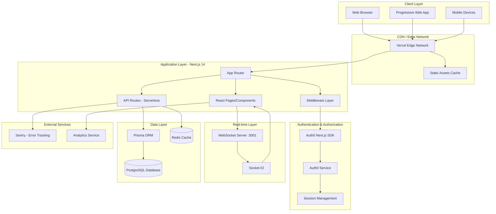
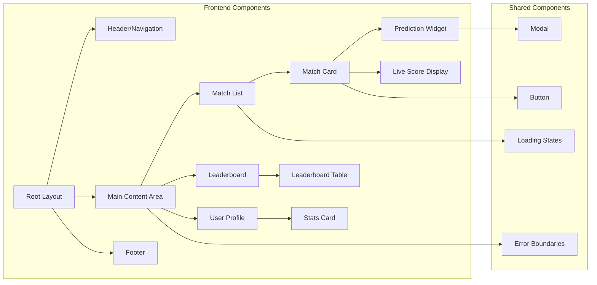
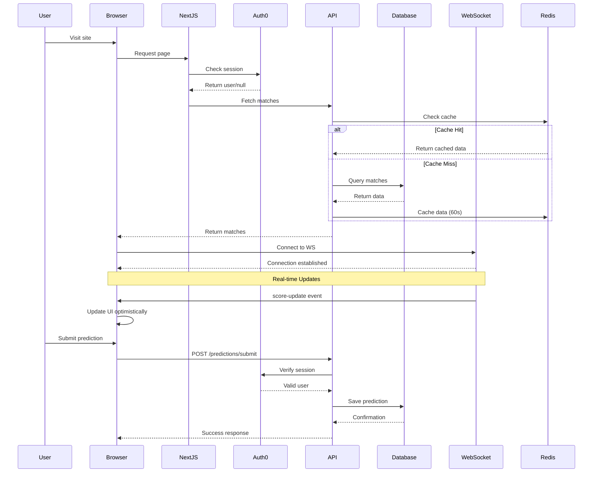
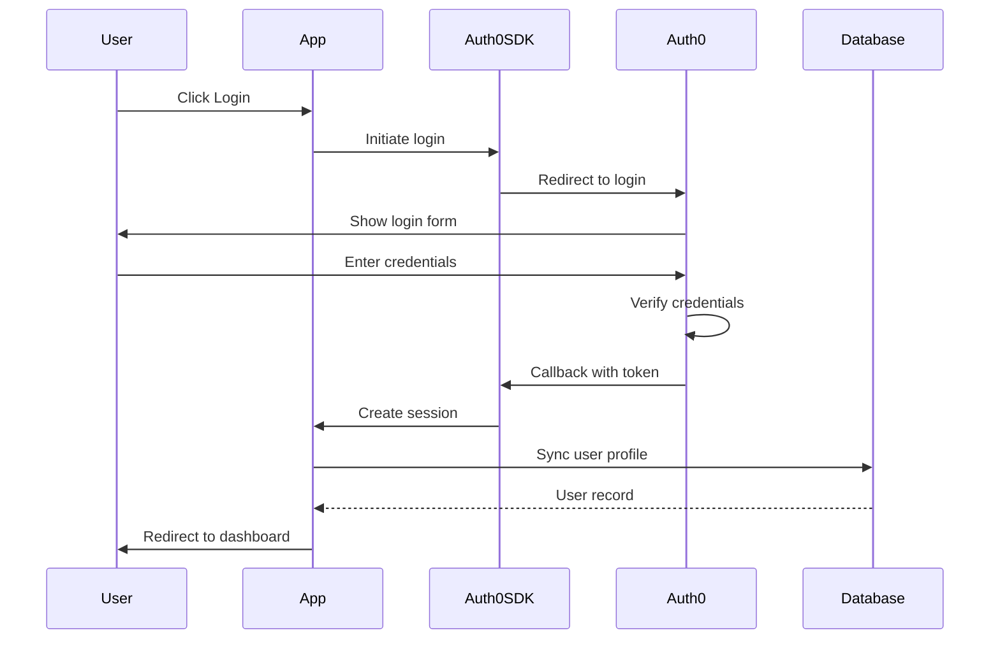
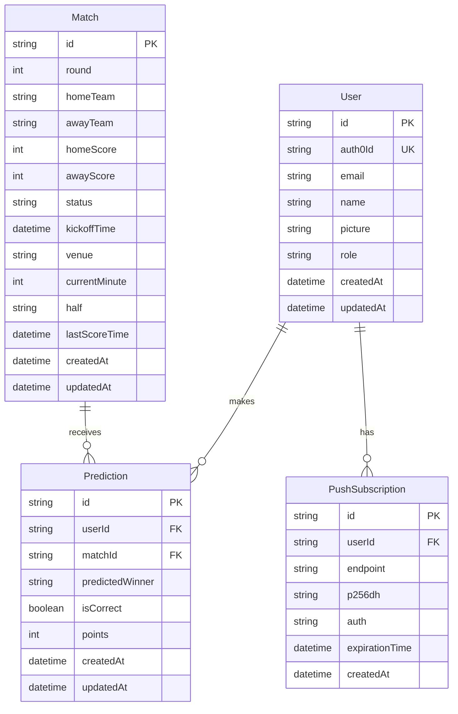
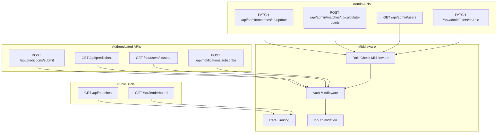
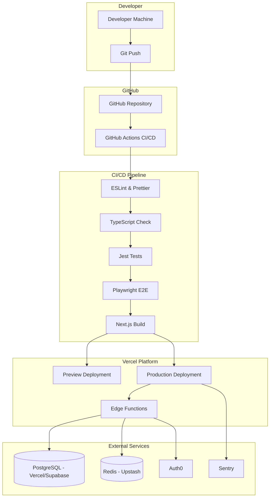
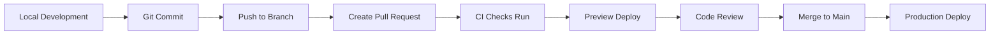

# NRL Fan Hub - Architecture Documentation

## System Architecture Overview

The NRL Fan Hub is a modern, scalable web application built with a serverless architecture using Next.js 14, Auth0, PostgreSQL, and real-time WebSocket communication.

## High-Level Architecture Diagram

## Component Architecture

## Data Flow Architecture

## Authentication Flow

## Database Schema

## API Architecture

## Deployment Architecture

## Technology Stack

### Frontend

- **Framework:** Next.js 14 (App Router)
- **Language:** TypeScript
- **Styling:** Tailwind CSS
- **State Management:** React Hooks + SWR
- **Real-time:** Socket.IO Client
- **Forms:** React Hook Form (if applicable)
- **Testing:** Jest + React Testing Library + Playwright

### Backend

- **Runtime:** Node.js 20+
- **API:** Next.js API Routes (Serverless)
- **ORM:** Prisma
- **Database:** PostgreSQL
- **Cache:** Redis (Upstash)
- **Real-time:** Socket.IO Server
- **Authentication:** Auth0

### DevOps & Infrastructure

- **Hosting:** Vercel
- **CI/CD:** GitHub Actions
- **Monitoring:** Sentry (optional)
- **Version Control:** Git + GitHub
- **Package Manager:** npm

## Key Design Decisions

### 1. Serverless Architecture

**Decision:** Use Next.js API routes with serverless functions
**Rationale:**

- Auto-scaling based on demand
- Cost-effective for variable traffic
- No server management overhead
- Global edge deployment

### 2. Prisma ORM

**Decision:** Use Prisma instead of raw SQL
**Rationale:**

- Type-safe database queries
- Excellent TypeScript integration
- Easy migrations and schema management
- Built-in connection pooling

### 3. Redis Caching

**Decision:** Cache leaderboard and high-traffic endpoints
**Rationale:**

- Reduce database load
- Improve response times (< 100ms)
- Handle 100K+ concurrent users
- Cost-effective scaling

### 4. WebSocket for Real-time

**Decision:** Separate WebSocket server on port 3001
**Rationale:**

- Persistent connections for live updates
- Efficient for real-time sports scores
- Better UX than polling
- Separated from serverless functions

### 5. Auth0 for Authentication

**Decision:** Use Auth0 instead of building custom auth
**Rationale:**

- Enterprise-grade security
- OAuth/Social login support
- Role-based access control
- Reduces development time

## Performance Optimizations

### Frontend

1. **Code Splitting:** Dynamic imports for heavy components
2. **Image Optimization:** Next.js Image component with WebP
3. **Lazy Loading:** Components below fold loaded on demand
4. **Bundle Optimization:** Tree shaking and minification
5. **Prefetching:** Link prefetching for faster navigation

### Backend

1. **Database Indexing:** Indexes on frequently queried fields
2. **Connection Pooling:** Prisma connection pooling
3. **Query Optimization:** Efficient joins and selective fields
4. **Redis Caching:** 60s TTL for leaderboard, 10s for matches
5. **CDN Caching:** Static assets cached at edge

### Network

1. **Edge Functions:** Deployed globally via Vercel
2. **Compression:** Gzip/Brotli for API responses
3. **HTTP/2:** Multiplexed connections
4. **Optimistic Updates:** UI updates before API confirmation

## Security Measures

### Authentication & Authorization

- Session-based auth with Auth0
- HTTP-only secure cookies
- CSRF protection
- Role-based access control (RBAC)

### API Security

- Input validation with Zod schemas
- Rate limiting per endpoint
- SQL injection prevention (Prisma ORM)
- XSS protection via React

### Infrastructure

- HTTPS only (TLS 1.3)
- Security headers (OWASP recommendations)
- Environment variables for secrets
- Vercel security features

## Scalability Considerations

### Current Capacity

- **Concurrent Users:** 100,000+
- **Requests/Second:** 10,000+
- **Database Connections:** 100 (pooled)
- **Cache Hit Rate:** > 80%

### Scaling Strategy

1. **Horizontal Scaling:** Serverless functions auto-scale
2. **Database:** Read replicas for heavy read operations
3. **Caching:** Increase Redis cluster size
4. **CDN:** Vercel Edge Network global distribution
5. **WebSocket:** Cluster WebSocket servers with Redis adapter

## Monitoring & Observability

### Metrics Tracked

- API response times
- Error rates and types
- Database query performance
- Cache hit/miss rates
- User engagement metrics

### Tools

- **Error Tracking:** Sentry (optional)
- **Performance:** Vercel Analytics
- **Logs:** Vercel Logs + CloudWatch
- **Uptime:** Vercel monitoring

## Development Workflow

## Testing Strategy

### Unit Tests (Jest)

- Component rendering
- Utility functions
- Business logic

### Integration Tests (Jest)

- API endpoints
- Database interactions
- Auth flows

### E2E Tests (Playwright)

- User journeys
- Critical paths
- Cross-browser testing

### Performance Tests

- Lighthouse audits
- Load testing with k6 (planned)

## Future Enhancements

### Phase 2 Features

1. **GraphQL API:** More flexible data fetching
2. **Microservices:** Split admin and public APIs
3. **Event Sourcing:** Better audit trails
4. **Advanced Analytics:** Custom dashboards
5. **Mobile Apps:** React Native apps
6. **AI Predictions:** ML-based predictions

### Infrastructure Improvements

1. **Multi-region Database:** Lower latency globally
2. **Kubernetes:** If moving away from serverless
3. **Message Queue:** For async processing (Bull/Redis)
4. **Elasticsearch:** For advanced search

## References

- [Next.js Documentation](https://nextjs.org/docs)
- [Prisma Documentation](https://www.prisma.io/docs)
- [Auth0 Next.js SDK](https://github.com/auth0/nextjs-auth0)
- [Socket.IO Documentation](https://socket.io/docs/v4/)
- [Vercel Platform](https://vercel.com/docs)

---

**Document Version:** 1.0
**Last Updated:** November 2025
**Maintained By:** Development Team
