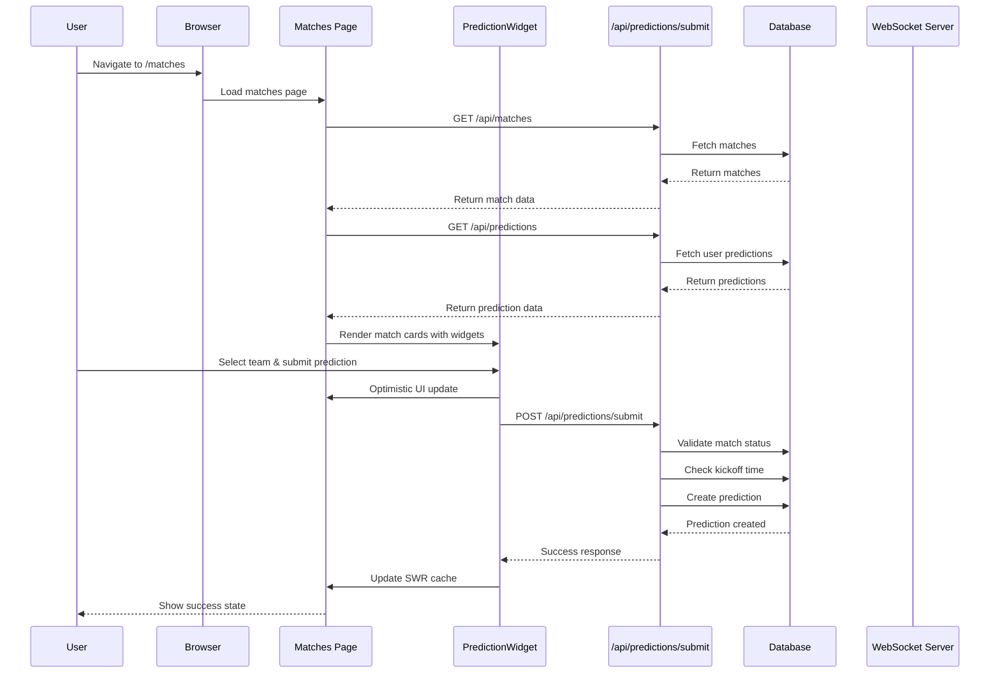
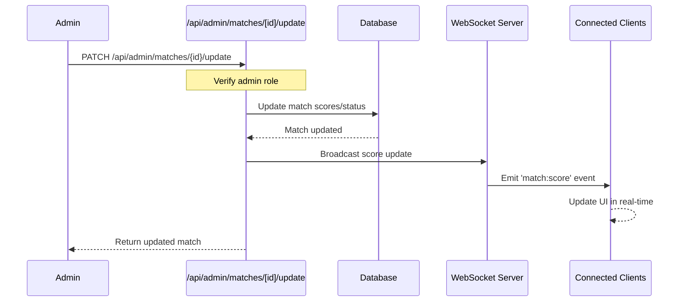
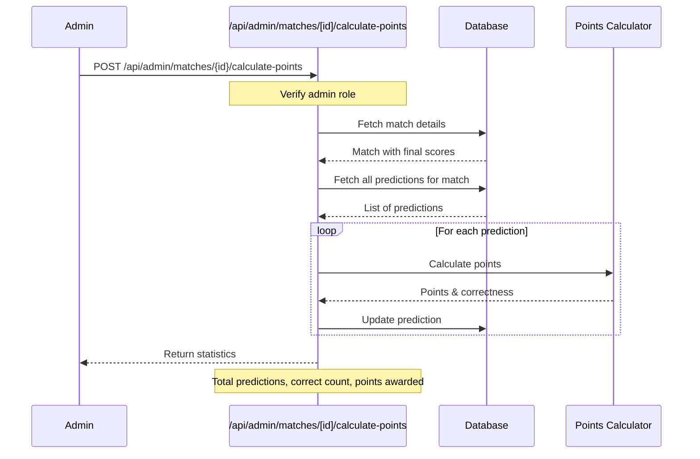
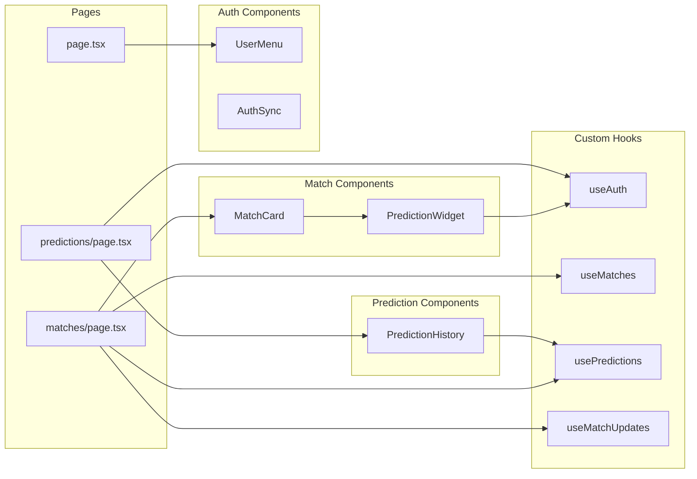
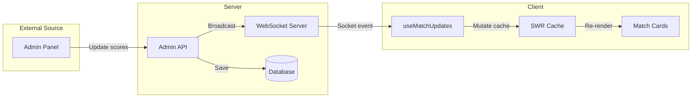
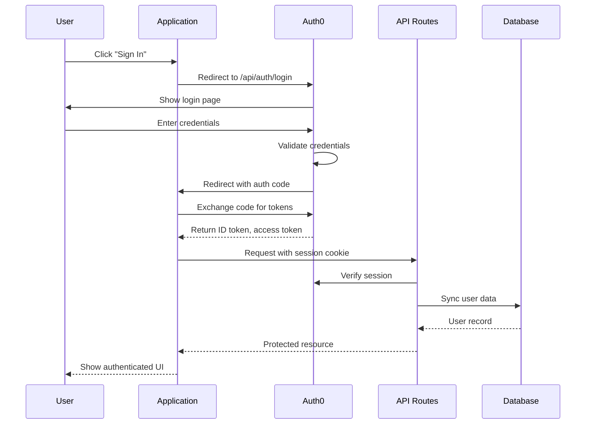
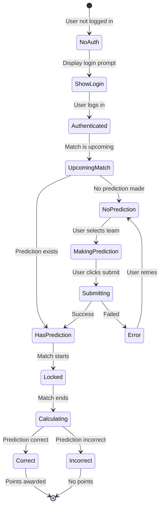

# NRL Fan Hub - Application Flow

## System Architecture

```mermaid
graph TB
    subgraph "Client Layer"
        Browser[Browser]
        HomePage[Home Page]
        MatchesPage[Matches Page]
        PredictionsPage[Predictions Page]
    end

    subgraph "Authentication"
        Auth0[Auth0]
        UserMenu[User Menu Component]
    end

    subgraph "Real-Time Layer"
        WS[WebSocket Server<br/>Socket.IO]
        WSHook[useMatchUpdates Hook]
    end

    subgraph "API Layer"
        MatchesAPI[/api/matches]
        PredictionsAPI[/api/predictions]
        SubmitAPI[/api/predictions/submit]
        AdminAPI[/api/admin/matches]
        CalcAPI[/api/admin/matches/calculate-points]
    end

    subgraph "Data Layer"
        Prisma[Prisma ORM]
        PostgreSQL[(PostgreSQL Database)]
    end

    subgraph "Database Schema"
        UserTable[User Table]
        MatchTable[Match Table]
        PredictionTable[Prediction Table]
    end

    Browser --> HomePage
    Browser --> MatchesPage
    Browser --> PredictionsPage

    HomePage --> UserMenu
    MatchesPage --> UserMenu
    PredictionsPage --> UserMenu

    UserMenu --> Auth0

    MatchesPage --> MatchesAPI
    MatchesPage --> PredictionsAPI
    MatchesPage --> SubmitAPI
    MatchesPage --> WSHook

    PredictionsPage --> PredictionsAPI

    WSHook --> WS
    WS --> MatchesPage

    AdminAPI --> WS
    AdminAPI --> Prisma
    CalcAPI --> Prisma

    MatchesAPI --> Prisma
    PredictionsAPI --> Prisma
    SubmitAPI --> Prisma

    Prisma --> PostgreSQL
    PostgreSQL --> UserTable
    PostgreSQL --> MatchTable
    PostgreSQL --> PredictionTable

    PredictionTable -.belongs to.-> UserTable
    PredictionTable -.belongs to.-> MatchTable
```

## User Flow - Making a Prediction



## Admin Flow - Updating Match Scores



## Prediction Points Calculation Flow



## Component Architecture



## Data Flow - Real-Time Match Updates



## Authentication Flow



## Prediction System State Machine



## Key Features

### 1. **Live Match Display**

- Real-time score updates via WebSocket
- Match status tracking (UPCOMING, LIVE, COMPLETED)
- Live indicator with animation
- Automatic UI updates without refresh

### 2. **Prediction System**

- Submit predictions before kickoff
- Automatic locking at match start
- Optimistic UI updates
- Points calculation (10 base + 5 bonus for 12+ point margin)

### 3. **Prediction History**

- View all predictions with filtering
- Stats dashboard (total, correct, points, accuracy)
- Real-time updates

### 4. **Authentication & Authorization**

- Auth0 integration
- Role-based access (USER, MODERATOR, ADMIN)
- Protected API routes
- Session management

## Technology Stack

- **Frontend**: Next.js 15, React, TypeScript, Tailwind CSS
- **Backend**: Next.js API Routes, Node.js custom server
- **Database**: PostgreSQL with Prisma ORM
- **Real-time**: Socket.IO
- **Authentication**: Auth0
- **State Management**: SWR for data fetching
- **Testing**: Jest, React Testing Library
